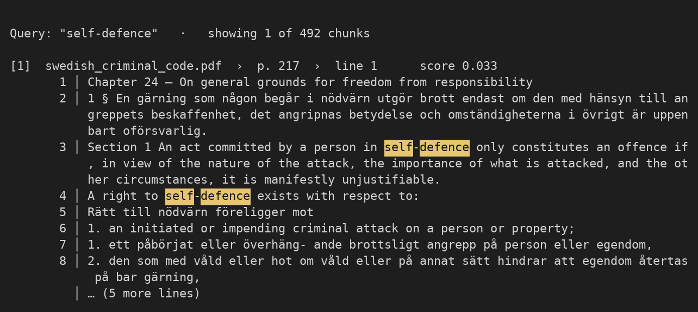

# legendary-potato

Hybrid search experiment for legal PDFs — fully local, no API keys, no cloud.

Two retrievers over your PDFs, fused:

- **Semantic** — a local multilingual embedding model (Swedish + English).
- **Keyword** — BM25 (exact terms, names, statute numbers).
- **Hybrid** — the two fused with reciprocal-rank fusion.

Text is extracted with **PyMuPDF** (fast, lightweight); every result cites its source file and page.

## Setup

Open in VS Code and **Reopen in Container** (`.devcontainer/`). It installs `uv` and deps.
The first search downloads the embedding model (~0.5 GB) once.

## Use

```bash
bash scripts/get_sample_pdf.sh                       # → data/swedish_criminal_code.pdf (real, public)
uv run python -m legendary_potato "unlawful threat"          # basic hybrid search (top 5)

# Swedish query — the embedding model is multilingual
uv run python -m legendary_potato "olaga hot"

# natural-language / conceptual query (semantics, not just literal terms)
uv run python -m legendary_potato "when is self-defence allowed"

# more results
uv run python -m legendary_potato -k 10 "theft and robbery"

# show more context per hit (default is 18 lines)
uv run python -m legendary_potato --max-lines 30 "bribery of a public official"

# search your own folder of PDFs instead of data/
uv run python -m legendary_potato --docs ~/cases "breach of contract"

# turn off highlighting when writing results to a file
uv run python -m legendary_potato --color never "theft" > hits.txt
```

Drop your own PDFs in `data/` (gitignored — sensitive files stay on your machine).

Options: `--docs DIR` (default `data`), `-k N` (default 5), `--color auto|always|never`,
`--max-lines N` (default 18). Each result shows per-page line numbers (one per paragraph
block), full context, and highlighted query terms.

## Test

```bash
uv run pytest
```

A fast citation check plus a smoke test that builds a tiny PDF and confirms the
right page comes back from the full search pipeline.

## Architecture

A single pass, all in memory, all local:

```
data/*.pdf
    │
    ▼
PyMuPDF (text blocks)
    │
    ▼
SentenceSplitter
    │
    ├─────────────────────┐
    ▼                     ▼
    VectorStoreIndex      BM25Retriever
    (embeddings)          (keyword / lexical)
    │                     │
    └───┬─────────────────┘
        ▼
        QueryFusionRetriever   (reciprocal-rank fusion)
        │
        ▼
        ranked results + citations   (file › page › line)
```

1. **Extract** — PyMuPDF reads each page as text *blocks* (paragraphs), one per line and one node-source per page. Keeping whole paragraphs (rather than short visual lines) reads better and keeps phrases intact for BM25.
2. **Chunk** — `SentenceSplitter` splits pages into ~512-token chunks (64 overlap).
3. **Retrieve** — the query runs through two retrievers over the same chunks:
   - **vector** — query + chunks embedded by a local multilingual model; cosine similarity returns the top *k*.
   - **BM25** — lexical scoring returns its own top *k*.
4. **Fuse** — `QueryFusionRetriever` merges them by reciprocal-rank fusion (`Σ 1/(k + rank)`, k=60); no LLM (`num_queries=1`).
5. **Cite** — results print as ranked snippets, each with a `file › page` citation.

| File | Role |
|------|------|
| `search.py` | extract (PyMuPDF) → chunk → build retrievers + fusion → cited results |
| `__main__.py` | CLI |

**Design choices**
- **Local-first:** every model runs on the machine — no API keys, no cloud. Documents never leave the box.
- **Lightweight extraction:** PyMuPDF has no layout model, so the whole thing is one fast in-memory pass — no separate ingest or cache step, and no memory blow-ups on large PDFs.
- **Hybrid retrieval:** embeddings catch paraphrase/meaning; BM25 catches exact terms, names, statute numbers. RRF merges them without needing comparable score scales.

## Key tech

| Tool | Role | Why this one |
|------|------|--------------|
| **[PyMuPDF](https://github.com/pymupdf/PyMuPDF)** | PDF → text, per page | fast, lightweight, solid text quality. Note: **AGPL** — shipping it in a closed-source commercial product needs an Artifex license |
| **[LlamaIndex](https://github.com/run-llama/llama_index)** | retrieval plumbing — chunking, `VectorStoreIndex`, `BM25Retriever`, `QueryFusionRetriever` | batteries-included, swappable pieces |
| **`paraphrase-multilingual-MiniLM-L12-v2`** (sentence-transformers via HuggingFace) | local semantic embeddings | small + fast on CPU, handles Swedish *and* English, no API key |
| **[bm25s](https://github.com/xhluca/bm25s)** (via `llama-index-retrievers-bm25`) | lexical / keyword retrieval | catches exact terms, names, statute numbers embeddings miss |
| **[uv](https://github.com/astral-sh/uv)** | dependency + virtualenv management | fast, reproducible via `uv.lock` |
| **Dev Containers** (VS Code · `mcr…/python:3.12`) | reproducible Linux dev environment | one-click setup |

There is no LLM and no external API in the pipeline. An optional answer-generation layer
(e.g. a local model via Ollama) would slot in after step 5.

## Notes

- PyMuPDF reads the embedded text layer; it does **not** OCR. Scanned/image PDFs would need OCR
  first (e.g. Tesseract / `ocrmypdf`).
- Text is extracted as blocks (paragraphs), which keeps multi-column / parallel-language layouts readable (one language per block). A `line N` in a citation is the Nth block on the page, not an exact visual line.
- The index is built in memory on each run; persisting it is the next step for large corpora.

## Appendix — sample console output

Actual terminal output of `uv run python -m legendary_potato "self-defence"`, with query
terms highlighted exactly as they appear in the console:



The blocks below are the same output as copy-pasteable text (`--color never`); each
block-mode line is a full paragraph, so long lines are abbreviated with `…`.

```text
$ uv run python -m legendary_potato "when is self-defence allowed" -k 1

Query: "when is self-defence allowed"   ·   showing 1 of 492 chunks

[1]  swedish_criminal_code.pdf  ›  p. 217  ›  line 1      score 0.033
       1 │ Chapter 24 – On general grounds for freedom from responsibility
       2 │ 1 § En gärning som någon begår i nödvärn utgör brott endast om den … är uppenbart oförsvarlig.
       3 │ Section 1 An act committed by a person in self-defence only constitutes an offence if … it is manifestly unjustifiable.
       4 │ A right to self-defence exists with respect to:
       5 │ Rätt till nödvärn föreligger mot
       6 │ 1. an initiated or impending criminal attack on a person or property;
         │ … (7 more lines)

$ uv run python -m legendary_potato "theft and robbery" -k 1

Query: "theft and robbery"   ·   showing 1 of 492 chunks

[1]  swedish_criminal_code.pdf  ›  p. 72  ›  line 1      score 0.017
       1 │ Chapter 8 – On theft, robbery and other appropriative offences
       2 │ 1 § Den som olovligen tager vad annan tillhör med uppsåt att tillägna sig det … för stöld till fängelse i högst två år.
       3 │ Section 1 A person who unlawfully takes what belongs to another person with intent to acquire it … guilty of theft and is sentenced to imprisonment for at most two years.
       4 │ 2 § Är brott som avses i 1 § … döms för ringa stöld till böter eller fängelse i högst sex månader. Lag (2017:442).
         │ … (7 more lines)
```

